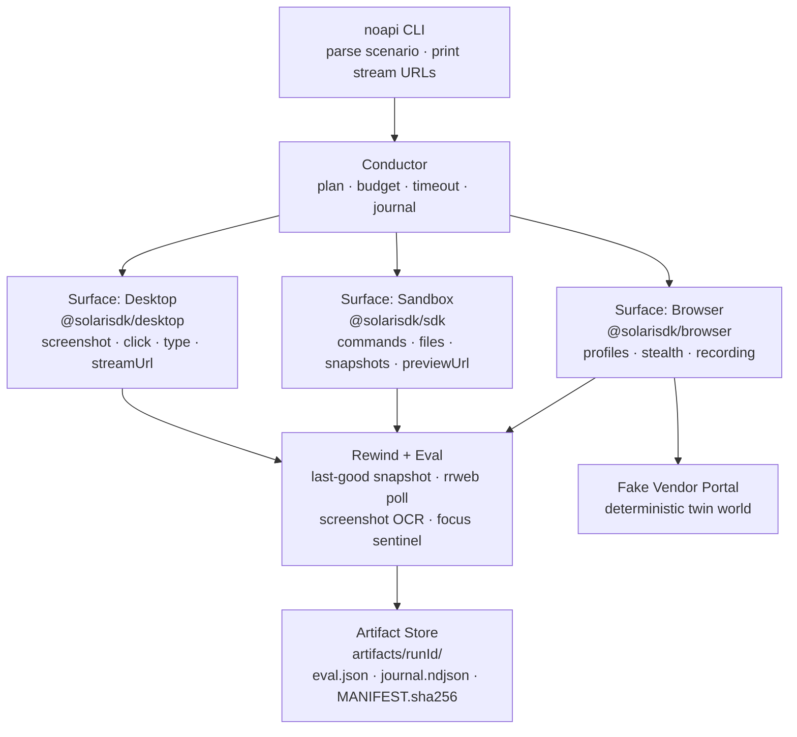

# NOAPI

**An agent that finishes work where there is no API.**

NOAPI is a reliability-first conductor that treats Solari's cloud **browser**, **sandbox**, and **desktop** as one machine. It closes the books on a fake vendor portal — pull invoices in the browser, reconcile in a sandbox, format the pack in LibreOffice on a desktop, upload the PDF — and proves every step with artifacts, replays, and a green `eval.json`.

```bash
export SOLARI_API_KEY=slr_live_...   # https://console.getsolari.com
make demo                            # ~45s, ~$0.002 on Starter (measured)
```

Prerequisites for the scored run: Node 22+, and `tesseract` on PATH for the screenshot OCR predicate (`sudo apt-get install tesseract-ocr`). The conductor serves the portal from inside the run's own sandbox (`previewUrl`), so a cloud browser never needs to reach your localhost — and a one-VM account works too.

No key? `make demo-offline` runs the whole twin world with curl — no Solari, no cost.

<!-- GIF slot: 20s of VNC — LibreOffice on a Solari desktop receiving the exceptions. -->
<!--  -->

> Browser pulled. Sandbox reconciled and snapshotted. Desktop formatted the pack. Eval passed. Cost $0.xx.

_Last recorded run: replay + preview URLs live in `artifacts/<runId>/eval.json` (they expire with the plan's retention window; the artifacts do not)._

This repo is a fork of the [Solari cookbook](https://github.com/solari-sdk/solari-cookbook) — the official examples live in [`examples/`](examples/) and every NOAPI surface call maps to one of them (table below). The original cookbook README is preserved at [docs/COOKBOOK.md](docs/COOKBOOK.md).

## The five questions

1. **All three Solari surfaces in one workflow?** Yes — browser (login, download, upload), sandbox (reconcile, snapshot), desktop (LibreOffice, proof screenshots), one run.
2. **Work with no clean API?** Yes — the punchline is LibreOffice driven by mouse and keyboard on a cloud desktop, because the close pack has no API.
3. **Reliability as a subsystem, not try/except?** Yes — rewind policy, eval predicates, journal, budget guard, and a manifest of hashed artifacts are first-class modules (`src/rewind/`, `src/eval/`, `src/journal.ts`, `src/budget.ts`, `src/manifest.ts`).
4. **Can a human watch it?** Yes — desktop `streamUrl` (VNC) is printed at run start, browser sessions record rrweb replays (`recording: true` on every scored run), and every desktop step leaves timestamped screenshots.
5. **One command + one key to rerun?** Yes — see above. One `SOLARI_API_KEY` across browsers, sandboxes, and desktops. That is the product.

## Architecture



## Why it doesn't restart the universe

Most computer-use demos restart the world on failure. NOAPI restarts the step:

| Surface | Time-travel primitive | How NOAPI uses it |
|---|---|---|
| Browser | rrweb NDJSON replay (opt-in per session) | Recording is on for every scored run; replay is polled (~30s) and stored even on failure |
| Sandbox | VM snapshot (+ opt-in revert) | After `reconcile` succeeds, the VM is snapshotted (`close-numbers-ok`). If the desktop step fails, the parse is not rerun — the conductor resumes at `format` against the last-good state |
| Desktop | Screenshot ring buffer | Last 10 frames kept; on a focus miss the failed GUI session is discarded, the frames are saved, and the click is replanned |

The policy is data (`src/rewind/policy.ts`): rewind on `desktop.focus_miss` / `desktop.app_not_ready` up to 2 attempts; never rewind on `budget_exceeded` or `portal_rejected_auth`; always keep failed artifacts. Snapshot **revert** on rewind is opt-in (`NOAPI_REWIND_REVERT=1`) — on the current pool a revert attempt itself disrupts the VM (measured live: heartbeats fail, preview portal 404s), and it is protective-only since nothing writes to the sandbox after the snapshot.

`make demo-flaky` forces a real desktop focus miss — the CSV **Text Import modal is canceled**, so no document loads and typing into the Start Center renders nothing — and the run still finishes green with `rewinds: 1` (verified live).

## Cookbook conformance

Every surface call maps to an official example in [`examples/`](examples/):

| NOAPI call | Cookbook example | Rule encoded |
|---|---|---|
| `surfaces/browser.ts` launch / close | [`browser-quickstart-ts`](examples/browser-quickstart-ts) | `browser.close()` releases the slot; `solari.close()` drops the loopback proxy — skip it and the process hangs |
| stealth / proxy options | [`browser-stealth-proxy-ts`](examples/browser-stealth-proxy-ts) | proxy and captcha require `stealth: true`; free plan degrades to a plain launch |
| `profiles.save` after login | [`browser-profiles-ts`](examples/browser-profiles-ts) | attaching a profile does not auto-save; save is explicit |
| `recording: true` + replay poll | [`browser-session-recording-py`](examples/browser-session-recording-py) | recording is opt-in per session — no flag, replay 404s forever; upload is async after release, so poll ~30s |
| `surfaces/sandbox.ts` commands / files | [`sandbox-quickstart-ts`](examples/sandbox-quickstart-ts) | `commands.run` is argv, not shell — `run("sh", { args: ["-c", ...] })`; `kill()` destroys the VM, `close()` leaves it burning credits |
| reconciliation kernel | [`sandbox-code-interpreter-py`](examples/sandbox-code-interpreter-py) | stateful work happens inside the VM; invoices are never parsed on the laptop |
| `previewUrl(port)` | [`sandbox-port-preview-ts`](examples/sandbox-port-preview-ts) | background servers via `nohup ... &`; poll until the preview answers |
| `surfaces/desktop.ts` open / click / type | [`desktop-computer-use-py`](examples/desktop-computer-use-py) | probe binaries with `command -v`; click the document (320,300), never screen center; `destroy(sessionId)`, not just `close()` |

`timeoutMs` is treated everywhere as a **rolling idle window**: the sandbox heartbeats during long desktop steps so a live session is never murdered mid-thought.

## What a run produces

`artifacts/<runId>/` — an evidence pack a controller could file:

```
journal.ndjson      # every step.start / step.ok / step.fail / rewind / cost / artifact
eval.json           # the scoreboard — ok, predicates, wallMs, costUsdEstimate, rewinds
invoices.zip        # pulled from the portal (sha256 golden-checked)
exceptions.csv      # reconciled inside the sandbox (2 seeded exceptions)
chart.png           # exception counts by reason
close-pack.pdf      # formatted on the desktop, uploaded to the portal
desktop-*.png       # ring-buffer frames incl. the focus-miss proof shot
desktop-final.png   # the visible document — feeds the OCR predicate
browser.ndjson      # rrweb replay (gzipped upload, polled ~30s after release)
eval.json           # also carries desktopRecordingUrl — the VM-side mp4 of the LibreOffice moment
dashboard.html      # static run viewer (steps, stream/replay links, cost)
MANIFEST.sha256     # sha256 of every artifact — verify with `sha256sum -c`
```

## Cost

Budget is a hard guard, not a dashboard metric. `src/budget.ts` carries the published rates from <https://docs.getsolari.com/pricing> (browser $0.10/hr, 1vCPU/2GB sandbox $0.057/hr, desktop = sandbox + $0.02/hr live screen, on Starter) and the conductor refuses the next surface when the projected total would exceed `scenario.budgetUsd` ($0.50 for the default scenario). Measured on live runs: **~$0.002 per green run, ~45s wall** (browser ~35s, sandbox ~35s, desktop ~20s).

Free-plan degrade is built in: stealth/proxy/captcha are skipped on a failed stealth launch, and the dashboard preview falls back to the local `dashboard.html` (Free allows one concurrent sandbox, which reconciliation already used). Desktops themselves are Starter+ — on a Free key the run aborts cleanly at the desktop step with `Desktop requires a paid plan` (verified live).

## Commands

```bash
make doctor        # cheapest real launch + clean dispose (exit 2 without a key)
make demo          # vendor-close across all three surfaces
make demo-flaky    # forced desktop focus-miss → rewind → still green
make demo-offline  # portal + fixtures only, curl-driven, no Solari
make test          # unit + contract + offline integration tests
make coverage      # tests with V8 coverage
make typecheck     # tsc --noEmit (strict)
```

## What we did not build

- **No LLM steering the scored run.** `src/planner/llm.ts` exists, off by default, behind an explicit env flag. The demo is deterministic because the reliability claim is the demo.
- **No live third-party sites.** The portal is ours (`apps/portal/`), seeded and deterministic. Demo day has no captchas.
- **No agent framework, no message bus, no chat UI.** One Node process, three surface wrappers, one policy module.
- **No Python sidecar.** `@solarisdk/desktop` covers `open` / click / type / screenshot / `streamUrl` / `destroy`, so the whole control plane is TypeScript (verified against the SDK's published types).

Scenarios beyond vendor-close (insurance intake, paper replication), the time-travel debugger UI, snapshot algebra, and `SIGHUMAN` dual-control are sketched in `NOAPI-implementation-plan.md` §6 — deliberately unshipped. Two extras are worse than one finished product.

## Repo map

- `src/conductor.ts` — plan, budget, timeout, journal, rewind
- `src/surfaces/` — browser / sandbox / desktop wrappers (cookbook comments inline)
- `src/rewind/` — policy, focus sentinel, screenshot ring
- `src/eval/` — predicates, OCR probe, score
- `apps/portal/` — the deterministic twin world (selectors shared with the agent)
- `examples/` — the official Solari cookbook (upstream of this fork)
- `docs/REVIEWER.md` — the 90-second path for reviewers
- `NOAPI-implementation-plan.md` — the build spec

## License

MIT — same as the cookbook.
